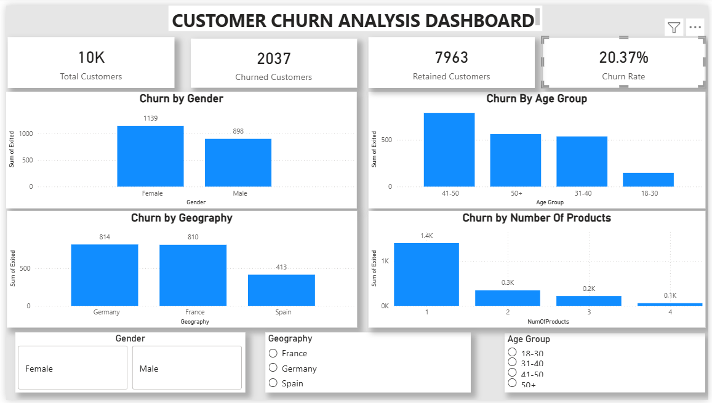

# 📊 Customer Churn Analysis Dashboard



## 🚀 Project Overview

The **Customer Churn Analysis Dashboard** is an interactive Power BI solution designed to analyze customer attrition patterns in a banking dataset. The dashboard helps identify high-risk customer segments and provides actionable insights to improve customer retention strategies.

---

## 🎯 Business Objective

Customer churn directly impacts business revenue and growth. The objective of this project is to:

- Identify customer segments with higher churn probability.
- Analyze churn trends across demographics and geography.
- Monitor key performance indicators (KPIs).
- Support data-driven customer retention decisions.

---

## 🛠️ Tools & Technologies

| Tool | Purpose |
|--------|---------|
| Power BI | Dashboard Development & Visualization |
| DAX | KPI & Measure Creation |
| Power Query | Data Cleaning & Transformation |
| CSV Dataset | Source Data |

---

## 📈 Key Performance Indicators (KPIs)

| KPI | Value |
|------|------:|
| Total Customers | 10,000 |
| Churned Customers | 2,037 |
| Retained Customers | 7,963 |
| Churn Rate | 20.37% |

---

## 📌 Dashboard Features

### KPI Cards
- Total Customers
- Churned Customers
- Retained Customers
- Churn Rate

### Interactive Filters (Slicers)
- Gender
- Geography
- Age Group

### Visual Analysis
- Churn by Gender
- Churn by Geography
- Churn by Age Group
- Churn by Number of Products

---

## 🔍 Key Insights

### 👩 Gender Analysis
- Female customers exhibited higher churn compared to male customers.

### 🌍 Geographic Analysis
- Germany recorded the highest churn among all regions.
- Spain showed the lowest churn rate.

### 👥 Age Group Analysis
- Customers aged **41–50** demonstrated the highest churn tendency.

### 🏦 Product Analysis
- Customers with only **one product** were significantly more likely to churn.

---

## 💡 Business Impact

This dashboard enables businesses to:

- Identify high-risk customer groups.
- Improve customer retention strategies.
- Reduce revenue loss caused by customer attrition.
- Make informed business decisions through interactive analytics.

---

## 📂 Repository Structure

```text
Bank-Customer-Churn-Analysis-PowerBI
│
├── Bank_Customer_Churn_Analysis.pbix
├── Churn_Modelling.csv
├── dashboard_screenshot.png
└── README.md
```

---

## 📷 Dashboard Preview

The dashboard includes:

✅ KPI Cards  
✅ Interactive Slicers  
✅ Churn Trend Analysis  
✅ Customer Segmentation Insights  
✅ Business-Focused Visualizations

---

## 👨‍💻 Author

**Raj Lalji Pandey**

Aspiring Data Analyst | Power BI | SQL | Data Analytics

---

## ⭐ Project Highlights

- Built an end-to-end Power BI dashboard.
- Created DAX measures for business KPIs.
- Performed customer segmentation analysis.
- Developed interactive and user-friendly visualizations.
- Generated actionable insights for customer retention.

---

### ⭐ If you found this project useful, consider giving it a star!
